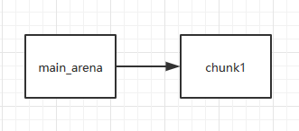

## Fastbin Attack

Ref: 

https://xz.aliyun.com/t/7490

https://ctf-wiki.org/pwn/linux/user-mode/heap/ptmalloc2/fastbin-attack/

1. fastbin大小<=64B（32位），fastbins中的chunk不改变它的prev_inuse标志，也就无法被合并
2. 首块double free检查，当一个chunk被free进fastbin前，会看看链表的第一个chunk【main_arena直接指向的块】是不是该chunk，如果是，说明double free了就报错，而对于链表后面的块，并没有进行验证。

```
fastbin attack就是fastbin类型的chunk中存在 堆溢出， uaf 等漏洞

用过一定手段篡改某堆块的fd指向一块目标内存（当然其对应size位置的值要合法），当我们malloc到此堆块后再malloc一次，自然就把目标内存分配到了，就可以对这块目标内存为所欲为了，达到任意地址写任意值的效果（可以是关键数据也可以是函数指针）
```

### double free
顾名思义，double free就是指fastbin的chunk被多次释放
```
int main(void)
{
    void *chunk1,*chunk2,*chunk3;
    chunk1=malloc(0x10);
    chunk2=malloc(0x10);

    free(chunk1);
    free(chunk2);
    free(chunk1);
    return 0;
}
```
第一次释放free(chunk1)



第二次释放free(chunk2)


第三次释放free(chunk1)


Example code: from https://ctf-wiki.org/pwn/linux/user-mode/heap/ptmalloc2/fastbin-attack/


```
typedef struct _chunk
{
    long long pre_size;
    long long size;
    long long fd;
    long long bk;
} CHUNK,*PCHUNK;

CHUNK bss_chunk;

int main(void)
{
    void *chunk1,*chunk2,*chunk3;
    void *chunk_a,*chunk_b;

    bss_chunk.size=0x21;
    chunk1=malloc(0x10);
    chunk2=malloc(0x10);

    free(chunk1);
    free(chunk2);
    free(chunk1);

    chunk_a=malloc(0x10);//chunk1 near by main_arena
    *(long long *)chunk_a=&bss_chunk;
    malloc(0x10);//chunk2
    malloc(0x10);//chunk1 far by main_arena
    chunk_b=malloc(0x10);//malloc target memory
    printf("%p",chunk_b);
    return 0;
}
```

注意因为 chunk1 被再次释放因此其 fd 值不再为 0 而是指向 chunk2，这时如果我们可以控制 chunk1 的内容，便可以写入其 fd 指针从而实现在我们想要的任意地址分配 fastbin 块。 

首先跟前面一样构造 main_arena=>chunk1=>chun2=>chunk1 的链表。之后第一次调用 malloc 返回 chunk1,之后调用malloc返回chunk2，再调用malloc返回chunk1,接着继续调用malloc，此时chunk1的fd 指针指向 bss 段上的 bss_chunk，就可以发现fastbin 会把堆块分配到这里。

接着对这块地址进行写入，实现了任意地址写入，这个过程有一个关键点是设定size.
值得注意的是，我们在 main 函数的第一步就进行了`bss_chunk.size=0x21;`的操作，这是因为_int_malloc 会对欲分配位置的 size 域进行验证，如果其 size 与当前 fastbin 链表应有 size 不符就会抛出异常。