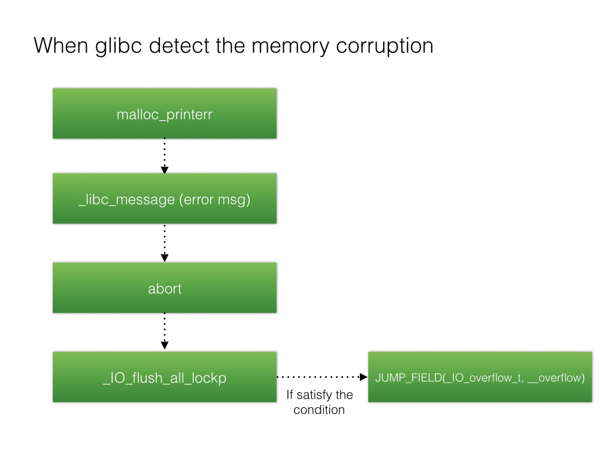

## IO_FILE_EXPLOIT

### FILE 结构
FILE 在 Linux 系统的标准 IO 库中是用于描述文件的结构，称为文件流。 FILE 结构在程序执行 fopen 等函数时会进行创建，并分配在堆中。我们常定义一个指向 FILE 结构的指针来接收这个返回值。

FILE 结构定义在 libio.h 中，如下所示

```
struct _IO_FILE {
  int _flags;       /* High-order word is _IO_MAGIC; rest is flags. */
#define _IO_file_flags _flags

  /* The following pointers correspond to the C++ streambuf protocol. */
  /* Note:  Tk uses the _IO_read_ptr and _IO_read_end fields directly. */
  char* _IO_read_ptr;   /* Current read pointer */
  char* _IO_read_end;   /* End of get area. */
  char* _IO_read_base;  /* Start of putback+get area. */
  char* _IO_write_base; /* Start of put area. */
  char* _IO_write_ptr;  /* Current put pointer. */
  char* _IO_write_end;  /* End of put area. */
  char* _IO_buf_base;   /* Start of reserve area. */
  char* _IO_buf_end;    /* End of reserve area. */
  /* The following fields are used to support backing up and undo. */
  char *_IO_save_base; /* Pointer to start of non-current get area. */
  char *_IO_backup_base;  /* Pointer to first valid character of backup area */
  char *_IO_save_end; /* Pointer to end of non-current get area. */

  struct _IO_marker *_markers;

  struct _IO_FILE *_chain;

  int _fileno;
#if 0
  int _blksize;
#else
  int _flags2;
#endif
  _IO_off_t _old_offset; /* This used to be _offset but it's too small.  */

#define __HAVE_COLUMN /* temporary */
  /* 1+column number of pbase(); 0 is unknown. */
  unsigned short _cur_column;
  signed char _vtable_offset;
  char _shortbuf[1];

  /*  char* _save_gptr;  char* _save_egptr; */

  _IO_lock_t *_lock;
#ifdef _IO_USE_OLD_IO_FILE
};
struct _IO_FILE_complete
{
  struct _IO_FILE _file;
#endif
#if defined _G_IO_IO_FILE_VERSION && _G_IO_IO_FILE_VERSION == 0x20001
  _IO_off64_t _offset;
# if defined _LIBC || defined _GLIBCPP_USE_WCHAR_T
  /* Wide character stream stuff.  */
  struct _IO_codecvt *_codecvt;
  struct _IO_wide_data *_wide_data;
  struct _IO_FILE *_freeres_list;
  void *_freeres_buf;
# else
  void *__pad1;
  void *__pad2;
  void *__pad3;
  void *__pad4;

  size_t __pad5;
  int _mode;
  /* Make sure we don't get into trouble again.  */
  char _unused2[15 * sizeof (int) - 4 * sizeof (void *) - sizeof (size_t)];
#endif
};
```
进程中的 FILE 结构会通过_chain 域彼此连接形成一个链表，链表头部用全局变量_IO_list_all 表示，通过这个值我们可以遍历所有的 FILE 结构.


在标准 I/O 库中，每个程序启动时有三个文件流是自动打开的：stdin、stdout、stderr。因此在初始状态下，_IO_list_all 指向了一个由这些文件流构成的链表，但是需要注意的是这三个文件流位于 libc.so 的数据段。而我们使用 fopen 创建的文件流是分配在堆内存上的。

我们可以在 libc.so 中找到 stdin\stdout\stderr 等符号，这些符号是指向 FILE 结构的指针，真正结构的符号是
```
_IO_2_1_stderr_
_IO_2_1_stdout_
_IO_2_1_stdin_
```
但是事实上_IO_FILE 结构外包裹着另一种结构_IO_FILE_plus，其中包含了一个重要的指针 vtable 指向了一系列函数指针。

在 libc2.23 版本下，32 位的 vtable 偏移为 0x94，64 位偏移为 0xd8

```
struct _IO_FILE_plus
{
    _IO_FILE    file;
    IO_jump_t   *vtable;
}
```

vtable 是 IO_jump_t 类型的指针，IO_jump_t 中保存了一些函数指针，在后面我们会看到在一系列标准 IO 函数中会调用这些函数指针

```
void * funcs[] = {
   1 NULL, // "extra word"
   2 NULL, // DUMMY
   3 exit, // finish
   4 NULL, // overflow
   5 NULL, // underflow
   6 NULL, // uflow
   7 NULL, // pbackfail
   
   8 NULL, // xsputn  #printf
   9 NULL, // xsgetn
   10 NULL, // seekoff
   11 NULL, // seekpos
   12 NULL, // setbuf
   13 NULL, // sync
   14 NULL, // doallocate
   15 NULL, // read
   16 NULL, // write
   17 NULL, // seek
   18 pwn,  // close
   19 NULL, // stat
   20 NULL, // showmanyc
   21 NULL, // imbue
};
```
```
fread
fwrite
fopen
fclose
printf/puts
都是最后调用了vtable中的对应函数，然后进行系统调用

例如printf的调用栈为：
vfprintf+11
_IO_file_xsputn
_IO_file_overflow
funlockfile
_IO_file_write
write
```

### 伪造 vtable 劫持程序流程 

 Linux 中的一些常见的 IO 操作函数都需要经过 FILE 结构进行处理。尤其是_IO_FILE_plus 结构中存在 vtable，一些函数会取出 vtable 中的指针进行调用。

 因此伪造 vtable 劫持程序流程的中心思想就是针对_IO_FILE_plus 的 vtable 动手脚，通过把 vtable 指向我们控制的内存，并在其中布置函数指针来实现。

 因此 vtable 劫持分为两种：
 * 一种是直接改写 vtable 中的函数指针，通过任意地址写就可以实现（2.23之前）
 * 另一种是覆盖 vtable 的指针指向我们控制的内存，然后在其中布置函数指针

 Ref：https://ctf-wiki.org/pwn/linux/user-mode/io-file/fake-vtable-exploit/


 ### FSOP

 FSOP 是 File Stream Oriented Programming 的缩写，根据前面对 FILE 的介绍得知进程内所有的_IO_FILE 结构会使用_chain 域相互连接形成一个链表，这个链表的头部由_IO_list_all 维护.

 FSOP 的核心思想就是劫持_IO_list_all 的值来伪造链表和其中的_IO_FILE 项，但是单纯的伪造只是构造了数据还需要某种方法进行触发。FSOP 选择的触发方法是调用_IO_flush_all_lockp，这个函数会刷新_IO_list_all 链表中所有项的文件流，相当于对每个 FILE 调用 fflush，也对应着会调用_IO_FILE_plus.vtable 中的_IO_overflow。

 ```
 int
_IO_flush_all_lockp (int do_lock)
{
  ...
  fp = (_IO_FILE *) _IO_list_all;
  while (fp != NULL)
  {
       ...
       if (((fp->_mode <= 0 && fp->_IO_write_ptr > fp->_IO_write_base))
               && _IO_OVERFLOW (fp, EOF) == EOF)
           {
               result = EOF;
          }
        ...
  }
}
 ```

 

 而_IO_flush_all_lockp 不需要攻击者手动调用，在一些情况下这个函数会被系统调用：

1. 当 libc 执行 abort 流程时

2. 当执行 exit 函数时

3. 当执行流从 main 函数返回时

梳理一下 FSOP 利用的条件，首先需要攻击者获知 libc.so 基址，因为_IO_list_all 是作为全局变量储存在 libc.so 中的，不泄漏 libc 基址就不能改写_IO_list_all。

其实就是利用_IO_new_do_write，执行系统调用write，向控制台打印我们传入的_IO_write_base数据，进而泄漏libc基地址

绕过调用链上的检查！！！
Ref:

https://hollk.blog.csdn.net/article/details/113845320?spm=1001.2014.3001.5502


### glibc 2.24 下 IO_FILE 的利用

这个是真没看懂，补一补知识再补充吧

https://ctf-wiki.org/pwn/linux/user-mode/io-file/exploit-in-libc2.24/

finish